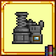

# Tile Function Library

**Tile Function Library** is a tModLoader library mod that eases the creation of some vanilla-like tiles.
This mod is a **dependency**, and must be referenced to be used. [Read more here.](https://github.com/tModLoader/tModLoader/wiki/Expert-Cross-Mod-Content#strong-references-aka-modreferences-expert)

This mod functions by using interfaces implemented on `ModTile` classes. All such interfaces (and their documentation) can be found in the `TileFunctionLibrary.API` namespace.

[Download the mod on Steam!](https://steamcommunity.com/sharedfiles/filedetails/?id=2917548131)

## Mod Calls
**You cannot add tile functionality using these `Mod.Call` methods.**

| Call | Description | Example
| --- | --- | --- |
| `"IsTileExtractinator", int tileType : bool` | Returns `true` if players can place extractible items into tiles of this type for loot. | `if (mod.Call("IsTileExtractinator", someTileType))  { /* ... */ }` | 
| `"IsTileChlorophyteExtractinator", int tileType, int whatToCheck : bool` | <para>**1.4.4 only.** Returns true if players can use the given tile type as a Chlorophyte Extractinator. Which aspect is checked depends on whatToCheck: - 0: If the given tile uses the Chlorophyte Extractinator's loot table. - 1: If the given tile performs the Chlorophyte Extractinator's item trades. Any other value: Returns false unless `tileType` is `TileID.ChlorophyteExtractinator`.</para> | `if (mod.Call("IsTileChlorophyteExtractinator", tileType, 0)) { /* ... */ }` |